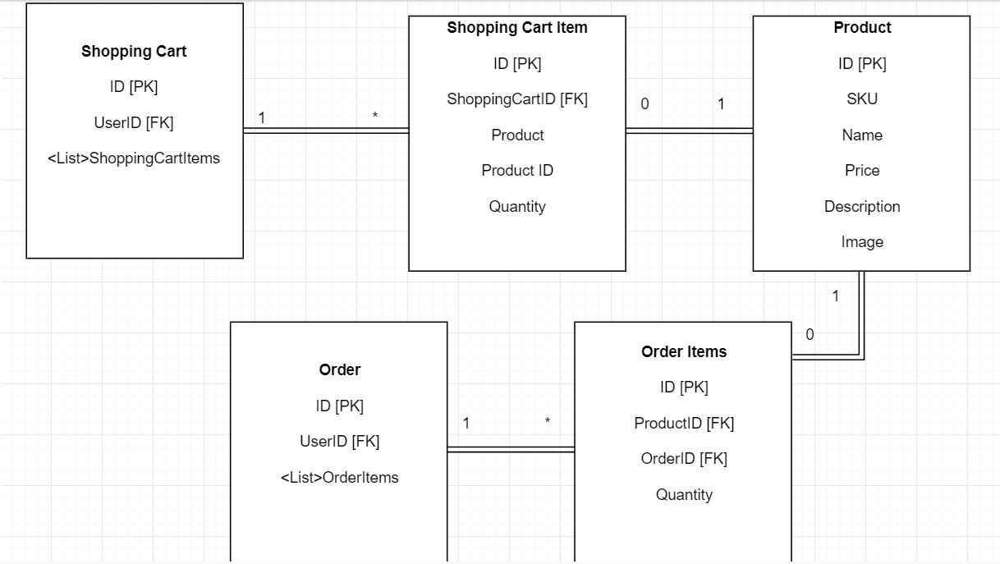

# E-Commerce Project: Maletero

## Authors

Deziree Teague & Charles Clemens

### Product

We are selling travel bags for every type of journey!  Products include: backpacks, duffle bags, suitecases, and accessories.

### Claims

* Full Name- to greet user upon login
* Date of Birth- for birthday discounts
* Email- for correspondence and purchase confirmation 
* State- to gain access to special products page

### Policies

* Washington State Only policy gives users who have registered as living in Washington state special access to Seahawk Bags

### OAUTH Providers

* Microsoft
* Google
* Facebook

### DB Schema

### Tables

The Shopping Cart table pulls in the UserID as it's foreign key.  The shopping Cart Item table has utilizes the Shopping Cart ID to form the one: many relationship.  Each Shopping cart can have many items.  Additionally, we have order and order items tables.  The order table also references the user Id so that it's specific to one user.  Order items use the product id and order id ad foreign keys.  Each order item references one product and each order has multiple items.  

### Azure Deployment

<https://maletero.azurewebsites.net/>